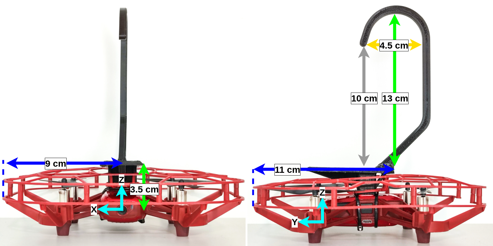
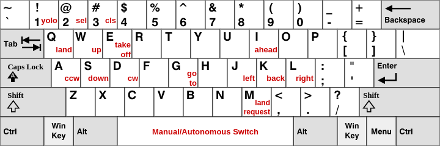

# Hanging Drone: An Approach to UAV Landing for Monitoring
Official implementation of **[Hanging Drone: An Approach to UAV Landing for Monitoring]()**

## Description

This work's approach allows a Tello Drone to land in strategic locations for data acquisition, resulting in significantly less battery consumption. The method uses principles from stereo vision through a monocular camera motion to estimate the relative position of a selected landing site, allowing a drone to hang itself by a hook in an artificial (e.g., aluminum frame, power line) or natural (e.g., tree branch) location. However, the system is limited to static landing sites where the FAST feature detector algorithm can detect features.

**See the demonstration video:**

<!---->
[](https://youtu.be/-aCFcoKEJI8)

## Drone Utilized



## Citation

```
@InProceedings{Cechinel:2023,
    author    = {Cechinel, Alan K. and Röning, Juha and Tikanmaki, Antti and De Pieri, Edson R. and Plentz, Patricia D. M.},
    title     = {{Hanging Drone}: An Approach to UAV Landing for Monitoring},
    booktitle = {Proceedings of the 20th International Conference on Informatics in Control, Automation and Robotics - ICINCO},
    month     = {},
    year      = {2023},
    pages     = {}
}
```

## Requirements

Install the [TelloPy](https://github.com/hanyazou/TelloPy) library and replace the original tello.py file with the [tello.py](extra/tello.py) (provided in this repository) modified to work with multiple drones. keep in mind that each drone must be connected to a dedicated WiFi interface.


```bash
git clone https://github.com/alankc/landing_pipeline
cd landing_pipeline
pip install -r requirements.txt
```

## Usage

The file parameters.yaml contains a series of parameters used by the system. To run the system with these default parameters just run:

```bash
python main.py
```

If you need to change parameters, you can either edit the parameters on parameters.yaml or create your own parameter file.
To run the system with a custom parameters file use:

```bash
python main.py -p your_file.yaml
```

### Running the system

### Control Modes

#### Waiting Connection

#### Manual Control
The manual mode is full of options. See the map of keys and a list explaining each key/function.



**General Options**
| Key | Function |
| :-: | :- |
| ESC | Land and Exit|
| 1 | Runs landing pipeline with Yolo (autonomous mode)|
| 2 | Runs landing pipeline with the selected shape (autonomous mode)|
| 3 | Reset the selected shape|
| m | Send a land request to recharge station|
| g | Open destination window|
| SPACE | Switch between autonomous and manual|

**Movement Options**
| Key | Function |
| :-: | :- |
| Left Hand |
| q | land |
| e | takeoff |
| w | up |
| s | down |
| a | rotate counterclockwise |
| d | rotate clockwise |
|Right Hand|
| i | forward |
| k | backward |
| j | left |
| l | right |

During the flight you can also select a location to land with the mouse, just start selecting the polygon with a left click.
Keys 2 and 3 are related to this option. After you select the landing site you can press 2 to the drone to try to hang itself there.

#### Manual Land

#### Autonomous Landing

#### Go To
